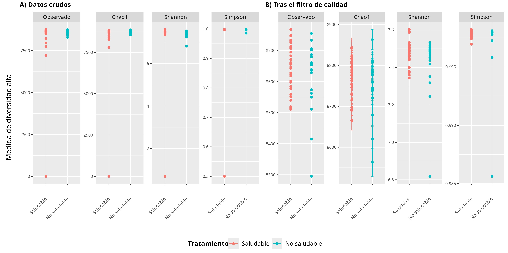
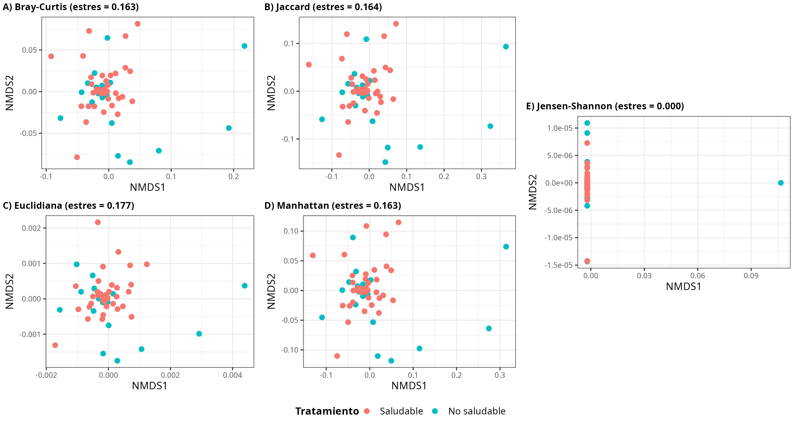
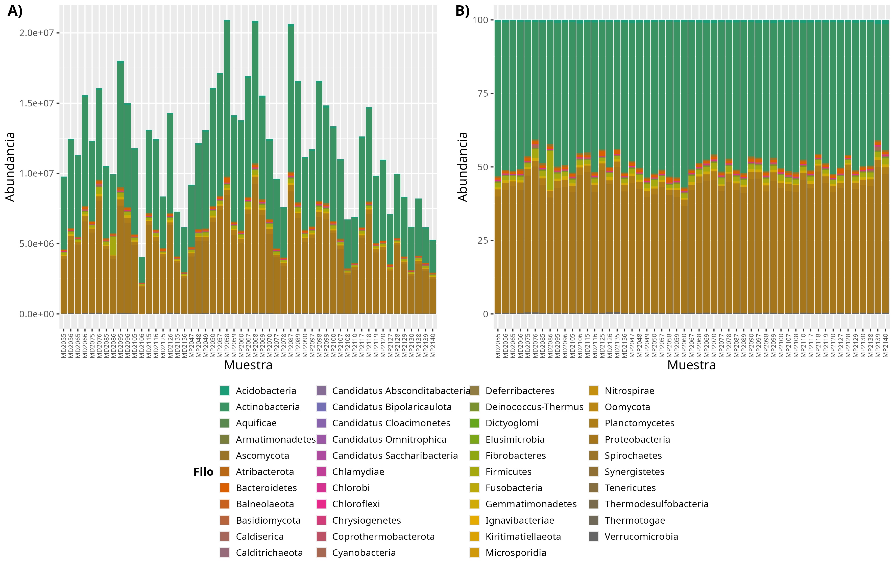
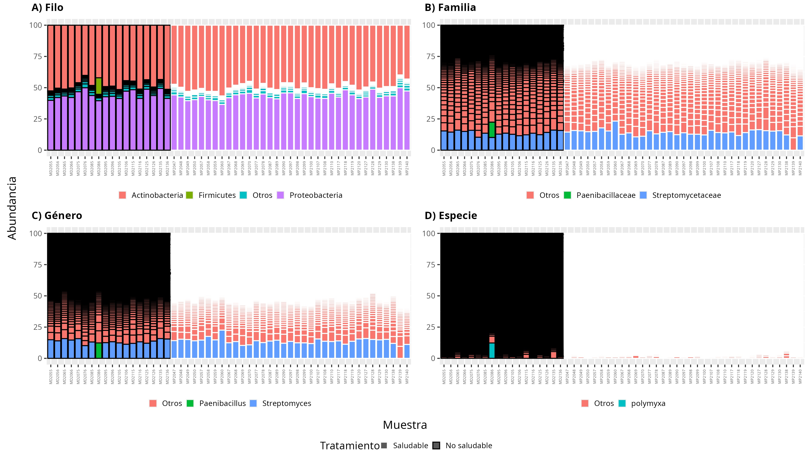
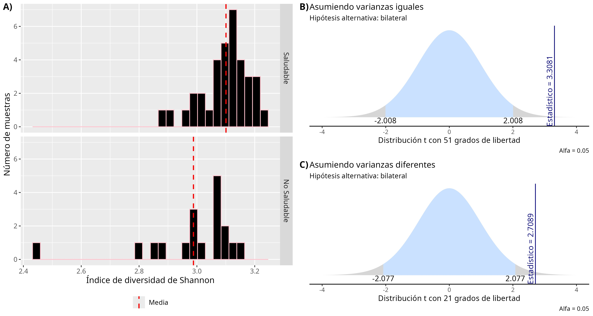
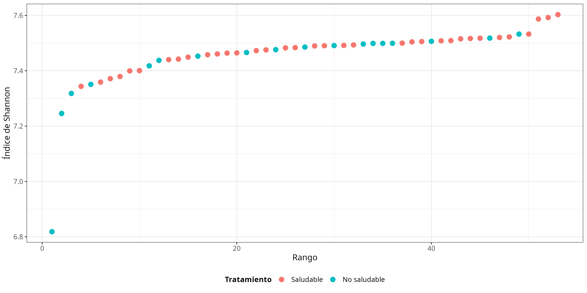

{width="15cm"}

**Artículo de investigación**

**Análisis estadístico de la diversidad microbiana a distintos niveles taxonómicos en datos metagenómicos de alta dimensión**

**Statistical Analysis of Microbial Diversity Across Taxonomic Levels in High-Dimensional Metagenomic Data**

**Análise estatística da diversidade microbiana em diferentes níveis taxonômicos em dados metagenômicos de alta dimensão**

**Paula Camila Silva Gómez**^[Posgrado Conjunto en Ciencias Matemáticas, Universidad Nacional Autónoma de México – Universidad Michoacana de San Nicolás de Hidalgo, Morelia, México. Contacto: csilva@universidadean.edu.co. ORCID: https://orcid.org/0009-0004-8054-2607]

**Nelly Sélem Mojica**^[Centro de Ciencias Matemáticas, Universidad Nacional Autónoma de México, Morelia, México. Contacto: nselem@matmor.unam.mx. ORCID: https://orcid.org/0000-0003-1697-3862]

**José Alexander Fuentes Montoya**^[Universidad EAN, Bogotá D.C., Colombia. Contacto: jamontoya.d@universidadean.edu.co. ORCID: https://orcid.org/0000-0001-6574-5677]

**RESUMEN**

El análisis de datos metagenómicos plantea un reto para la ciencia de datos por su volumen, alta dimensionalidad y naturaleza composicional. Este trabajo propone un flujo reproducible de análisis estadístico y bioinformático para caracterizar el microbioma rizosférico de cultivos de fresa (*Fragaria × ananassa*) e identificar patrones asociados con el estado sanitario de las plantas. Se analizaron 53 metagenomas *shotgun* (35 de plantas saludables y 18 no saludables), tras un control de calidad que excluyó las muestras con menos de 25 millones de lecturas. El flujo, implementado en R y Bash con phyloseq, integró la conversión al formato BIOM, el cálculo de índices de diversidad alfa (Chao1, Shannon y Simpson) y beta (Bray-Curtis, Jaccard, Euclidiana, Manhattan y Jensen-Shannon), la exploración taxonómica por nivel jerárquico y pruebas de hipótesis (t de Student, Welch y Mann-Whitney). Las plantas saludables tendieron a una mayor diversidad y equilibrio, mientras que las no saludables presentaron mayor abundancia relativa de taxones asociados con enfermedad. Sin embargo, las diferencias globales no alcanzaron significancia estadística; solo la diversidad de géneros de eucariotas, grupo que incluye a *Fusarium*, difirió significativamente entre grupos. El flujo propuesto es una base metodológica para desarrollar clasificadores del estado sanitario basados en biomarcadores microbianos.

**Palabras clave:** metagenómica; ciencia de datos; microbioma rizosférico; diversidad alfa; diversidad beta; *Fragaria × ananassa*; bioinformática; pruebas de hipótesis.

**ABSTRACT**

Metagenomic data analysis poses a challenge for data science because of the volume, high dimensionality, and compositional nature of the information generated by high-throughput sequencing. This work proposes a reproducible statistical and bioinformatic workflow to characterize the rhizosphere microbiome of strawberry crops (*Fragaria × ananassa*) and to identify patterns associated with plant health status. Fifty-three shotgun metagenomes (35 from healthy and 18 from unhealthy plants) were analyzed after a quality-control step that excluded samples with fewer than 25 million reads. The workflow, implemented in R and Bash with phyloseq, integrated conversion to the BIOM format, computation of alpha diversity indices (Chao1, Shannon, and Simpson) and beta diversity measures (Bray-Curtis, Jaccard, Euclidean, Manhattan, and Jensen-Shannon), taxonomic exploration by kingdom, phylum, family, genus, and species, and hypothesis testing (Student's t, Welch, and Mann-Whitney). Healthy plants showed a trend toward higher diversity and a more balanced community, whereas unhealthy plants exhibited a higher relative abundance of disease-associated taxa. However, global differences did not reach statistical significance; only the diversity of eukaryotic genera, a group that includes *Fusarium*, differed significantly between groups. The proposed workflow provides a methodological basis for developing plant-health classifiers based on microbial biomarkers.

**Keywords:** metagenomics; data science; rhizosphere microbiome; alpha diversity; beta diversity; *Fragaria × ananassa*; bioinformatics; hypothesis testing.

**RESUMO**

A análise de dados metagenômicos representa um desafio para a ciência de dados devido ao seu volume, alta dimensionalidade e natureza composicional. Este trabalho propõe um fluxo reproduzível de análise estatística e bioinformática para caracterizar o microbioma rizosférico de cultivos de morango (*Fragaria × ananassa*) e identificar padrões associados ao estado sanitário das plantas. Foram analisados 53 metagenomas *shotgun* (35 de plantas saudáveis e 18 não saudáveis), após um controle de qualidade que excluiu as amostras com menos de 25 milhões de leituras. O fluxo, implementado em R e Bash com phyloseq, integrou a conversão ao formato BIOM, o cálculo de índices de diversidade alfa (Chao1, Shannon e Simpson) e beta (Bray-Curtis, Jaccard, Euclidiana, Manhattan e Jensen-Shannon), a exploração taxonômica por nível hierárquico e testes de hipóteses (t de Student, Welch e Mann-Whitney). As plantas saudáveis tenderam a maior diversidade e equilíbrio, enquanto as não saudáveis apresentaram maior abundância relativa de táxons associados a doenças. No entanto, as diferenças globais não alcançaram significância estatística; apenas a diversidade de gêneros de eucariotos, grupo que inclui *Fusarium*, diferiu significativamente entre os grupos. O fluxo proposto é uma base metodológica para desenvolver classificadores do estado sanitário baseados em biomarcadores microbianos.

**Palavras-chave:** metagenômica; ciência de dados; microbioma rizosférico; diversidade alfa; diversidade beta; *Fragaria × ananassa*; bioinformática; testes de hipóteses.

**INTRODUCCIÓN**

El análisis de datos metagenómicos es, en esencia, un problema de ciencias de la computación: implica representar, almacenar, procesar y extraer patrones de estructuras de datos de muy alta dimensión bajo restricciones de escalabilidad y reproducibilidad. La metagenómica, entendida como el estudio del material genético recuperado directamente de muestras ambientales sin cultivo previo de los microorganismos, es uno de los dominios en los que esta perspectiva computacional resulta más evidente. Las tecnologías de secuenciación masiva producen matrices de conteos dispersas del orden de miles de taxones por muestra, cuya manipulación eficiente depende de estructuras de datos especializadas, de algoritmos de clasificación de secuencias y de flujos de trabajo diseñados con criterios de ingeniería de software: modularidad, trazabilidad y reproducibilidad (Marchesi y Ravel, 2015).

Desde el punto de vista algorítmico, la asignación taxonómica de las lecturas, es decir, la etapa que transforma millones de secuencias crudas en una matriz de conteos, se resuelve mediante la coincidencia exacta de *k*-meros contra bases de datos indexadas, como la implementada en Kraken (Wood y Salzberg, 2014), y puede complementarse con un refinamiento probabilístico de las abundancias mediante métodos de reestimación bayesiana como Bracken (Lu et al., 2017). El resultado es una matriz de conteos de alta dimensión y de naturaleza composicional: las abundancias relativas de cada muestra están restringidas al simplex, pues suman una constante, lo que invalida el uso ingenuo de la distancia euclidiana y de muchos supuestos estadísticos clásicos, e impone el uso de transformaciones y medidas de disimilitud específicas. Estas características, dispersión, alta dimensionalidad, composicionalidad y volumen, sitúan el análisis metagenómico en la intersección de la ciencia de datos, la estadística computacional y la bioinformática.

El microbioma rizosférico, la comunidad de bacterias, arqueas, hongos y otros microorganismos que habitan la interfaz entre la raíz y el suelo, cumple un papel central en la nutrición vegetal, la resistencia a fitopatógenos y la resiliencia de los cultivos ante condiciones ambientales adversas (Berendsen et al., 2012; Compant et al., 2019). Numerosos estudios han mostrado que la composición y la estructura de esta comunidad microbiana están estrechamente relacionadas con el estado de salud de la planta, lo que ha impulsado la búsqueda de biomarcadores microbianos capaces de anticipar o acompañar el diagnóstico de procesos de enfermedad (Siegieda et al., 2024).

La fresa (*Fragaria × ananassa*) es uno de los cultivos frutales de mayor relevancia comercial y nutricional en el mundo, pero su producción es particularmente sensible a enfermedades fúngicas y bacterianas del suelo, así como a las prácticas agrícolas y a las condiciones ambientales. En los últimos años, varios estudios han documentado diferencias taxonómicas consistentes entre rizósferas de fresa saludables y no saludables: géneros como *Udaeobacter* y *Solibacter*, junto con la familia Nitrosomonadaceae, tienden a ser más abundantes en rizósferas no saludables, mientras que taxones como Tepidisphaerales e *Hydrocarboniphaga* se asocian con condiciones saludables (Siegieda et al., 2024). Asimismo, se ha reportado que consorcios de rizobacterias promotoras del crecimiento vegetal (PGPR), como *Bacillus subtilis*, *Bacillus amyloliquefaciens* y *Pseudomonas monteilii*, modifican favorablemente el microbioma del suelo y la calidad del fruto (Nam et al., 2023), mientras que microorganismos fitopatógenos como *Fusarium* spp., *Phytophthora* spp. o *Botrytis cinerea* se han vinculado de manera recurrente con procesos de marchitez y pudrición radicular en este cultivo (Yang et al., 2020).

Estos hallazgos plantean una pregunta metodológica de fondo: ¿en qué medida las herramientas estadísticas convencionales, es decir, los índices de diversidad y la inferencia basada en pruebas de hipótesis, permiten capturar y validar formalmente las diferencias observadas a nivel taxonómico, considerando el tamaño de muestra moderado, la alta dimensionalidad y la naturaleza composicional propios de los estudios metagenómicos agrícolas? Responder esta pregunta exige no solo calcular los índices convencionales de diversidad alfa y beta, sino también evaluar su capacidad discriminante mediante pruebas de hipótesis paramétricas y no paramétricas, y explorar la estructura de los datos en distintos niveles jerárquicos de la taxonomía, desde el reino hasta la especie.

En este contexto, el presente trabajo tiene como objetivo diseñar e implementar un flujo de trabajo computacional reproducible, concebido como un artefacto de software modular, para el análisis estadístico de la diversidad microbiana del microbioma rizosférico de cultivos de fresa, a partir de datos metagenómicos proporcionados por la empresa de biotecnología agrícola Solena Ag. Específicamente, se busca: (i) establecer un procedimiento algorítmico de control de calidad y preprocesamiento de los datos de clasificación taxonómica generados con Kraken; (ii) caracterizar la diversidad alfa y beta de las comunidades microbianas asociadas con plantas saludables y no saludables, tanto a nivel global como en distintos niveles taxonómicos (reino, filo, familia, género y especie); (iii) contrastar estadísticamente las diferencias observadas mediante pruebas de hipótesis paramétricas (t de Student con varianzas iguales y prueba de Welch con varianzas distintas) y no paramétricas (Mann-Whitney); y (iv) discutir el potencial y las limitaciones de este flujo como base computacional para el desarrollo de modelos de aprendizaje automático y sistemas de apoyo a la decisión en agricultura de precisión basados en biomarcadores microbianos.

La contribución de este trabajo es, por lo tanto, metodológica y computacional: además de caracterizar el microbioma de la fresa, aporta un flujo reproducible, versionado y documentado, cuyos scripts y cuadernos de análisis están organizados por etapa, que puede ejecutarse de nuevo sobre nuevos conjuntos de datos o cultivos, y que constituye una base de ingeniería sobre la cual construir clasificadores automáticos del estado de salud de las plantas.

A diferencia de los estudios que se limitan a reportar diferencias descriptivas de abundancia entre grupos, este trabajo enfatiza la validación estadística formal de tales diferencias. Como se mostrará más adelante, la ausencia de significancia estadística a nivel global no invalida la existencia de patrones biológicamente relevantes en niveles taxonómicos más finos, una distinción metodológica con implicaciones directas para el diseño de futuros estudios y modelos predictivos en este dominio.

**METODOLOGÍA**

El flujo de trabajo propuesto se diseñó como una canalización computacional modular organizada en cinco etapas secuenciales: preprocesamiento y control de calidad, cálculo de índices de diversidad alfa, cálculo de índices de diversidad beta, exploración taxonómica a distintos niveles jerárquicos y validación estadística mediante pruebas de hipótesis. Todo el análisis se implementó de forma reproducible utilizando Bash para la orquestación y el formateo de los datos, y R con RStudio, con el paquete phyloseq como componente central, para el análisis estadístico y la visualización.

# Arquitectura computacional, estructuras de datos y reproducibilidad

Desde la perspectiva de la ingeniería de software, el flujo se implementó como una colección de scripts y cuadernos R Markdown numerados e independientes, uno por etapa, en la que cada módulo carga explícitamente su entrada, ejecuta una transformación bien delimitada y persiste sus salidas, ya sean figuras o tablas intermedias. Esta descomposición modular favorece la trazabilidad, la depuración y la reejecución selectiva, y permite tratar el análisis como un artefacto reproducible y versionable, en lugar de una secuencia de operaciones interactivas irrepetibles.

La estructura de datos central es el objeto phyloseq (McMurdie y Holmes, 2013), un contenedor que integra de manera coherente cuatro componentes: la matriz de conteos (taxón × muestra), la tabla de taxonomía, que codifica la jerarquía reino → filo → clase → orden → familia → género → especie, los metadatos de las muestras y, cuando está disponible, el árbol filogenético. La matriz de conteos, altamente dispersa, se almacena e intercambia mediante el formato BIOM (McDonald et al., 2012), un estándar basado en JSON o HDF5 optimizado para matrices de observaciones biológicas de gran tamaño. Las operaciones del flujo, aglomeración por rango taxonómico, transformación a abundancias relativas y cálculo de matrices de disimilitud entre pares de muestras, tienen costos computacionales bien caracterizados; en particular, el cálculo de la diversidad beta es cuadrático en el número de muestras, del orden de O(n²·p) para n muestras y p taxones, lo que motiva las decisiones de filtrado y aglomeración adoptadas para mantener el análisis tratable.

Para garantizar la reproducibilidad, todas las rutas se resolvieron de forma relativa a la raíz del proyecto, se fijó una semilla aleatoria en las etapas estocásticas que se reportan, como las ordenaciones NMDS, y se registraron las versiones de R y de los paquetes utilizados. El código completo se distribuye en un repositorio público con control de versiones, organizado por etapa y acompañado de documentación, de modo que los resultados y las figuras reportados puedan regenerarse a partir de los mismos datos de entrada.

# Diseño del estudio y fuente de datos

Se realizó un estudio observacional, transversal y exploratorio sobre datos metagenómicos secundarios de la rizósfera de cultivos de fresa (*Fragaria × ananassa*), proporcionados por la empresa Solena Ag, una compañía de biotecnología agrícola (AgTech) enfocada en el análisis y la mejora del microbioma del suelo mediante datos moleculares e inteligencia artificial. Las secuencias fueron entregadas en formato FASTQ, y los resultados de su clasificación taxonómica, obtenidos previamente con el clasificador Kraken (Wood y Salzberg, 2014), se entregaron como reportes por muestra, junto con los metadatos de cada una, incluida la variable de interés "Tratamiento", con dos niveles: saludable y no saludable (planta marchita). A diferencia de los flujos basados en amplicones (16S rRNA o ITS), que suelen apoyarse en plataformas como QIIME 2 (Bolyen et al., 2019) y en bases de datos de referencia curadas como SILVA (Quast et al., 2013), este estudio partió de una clasificación taxonómica de tipo *shotgun* generada con Kraken sobre la taxonomía del NCBI, lo que condiciona las decisiones de preprocesamiento que se describen a continuación.

# Preprocesamiento y control de calidad

El conjunto de datos original comprendía 58 muestras: 18 etiquetadas como no saludables y 40 como saludables. Antes de cualquier análisis de diversidad se llevó a cabo un proceso de control de calidad basado en una tabla resumen proporcionada por Solena Ag, construida a partir de fastp y de la salida de Kraken, que reportaba para cada muestra el número de lecturas antes y después del filtrado de calidad, el porcentaje de bases con calidad Phred superior a 30 antes y después del filtrado, el número de lecturas de baja calidad, el número de lecturas descartadas por contener bases ambiguas ("N"), el número de lecturas descartadas por longitud insuficiente, el porcentaje de duplicación, la longitud promedio de las lecturas (R1 y R2) y el porcentaje de lecturas efectivamente clasificadas.

Se estableció como criterio de exclusión un umbral mínimo de 25 millones de lecturas después del filtrado de calidad. Bajo este criterio se identificaron y eliminaron cinco muestras (MP2079, MP2080, MP2088, MP2109 y MP2137); en particular, la muestra MP2088 conservó únicamente dos lecturas tras el filtrado, lo que ilustra la necesidad de este control para evitar estimaciones de diversidad poco confiables basadas en profundidades de secuenciación insuficientes. Tras aplicar el filtro, el conjunto de datos quedó conformado por 53 muestras, 35 saludables y 18 no saludables, proporción que se mantuvo constante en todos los análisis posteriores.

Los reportes de Kraken se convirtieron al formato estándar BIOM (*Biological Observation Matrix*; McDonald et al., 2012) con la herramienta kraken-biom, lo que permitió almacenar de manera eficiente e interoperable las matrices de abundancia y sus metadatos asociados. A partir del archivo BIOM y de los metadatos, los datos filtrados se estructuraron como un objeto phyloseq (McMurdie y Holmes, 2013). El flujo de datos completo siguió la secuencia FASTQ (secuencias crudas) → reportes de Kraken (clasificación taxonómica) → BIOM → objeto phyloseq.

# Índices de diversidad alfa

La diversidad alfa cuantifica la riqueza y la equidad de las especies dentro de una muestra o comunidad. Para una muestra con S taxones observados, se denota por pᵢ la abundancia relativa del taxón i, de modo que la suma de las pᵢ es igual a 1. Sobre el objeto phyloseq filtrado se calcularon tres índices complementarios. El primero es Chao1 (Chao, 1984), un estimador no paramétrico de la riqueza total de especies, incluidas las no observadas, que se basa en el número de *singletons* (F₁, taxones con una sola lectura) y *doubletons* (F₂, taxones con exactamente dos lecturas). En su forma corregida por sesgo, que es la que calcula phyloseq, se define como

```{=openxml}
<w:p><w:pPr><w:tabs><w:tab w:val="center" w:pos="4252"/><w:tab w:val="right" w:pos="8504"/></w:tabs><w:spacing w:before="120" w:after="120" w:line="360" w:lineRule="auto"/></w:pPr><w:r><w:rPr><w:rFonts w:ascii="Times New Roman" w:hAnsi="Times New Roman" w:cs="Times New Roman"/><w:sz w:val="24"/></w:rPr><w:tab/><w:t xml:space="preserve">S</w:t></w:r><w:r><w:rPr><w:rFonts w:ascii="Times New Roman" w:hAnsi="Times New Roman" w:cs="Times New Roman"/><w:sz w:val="24"/><w:vertAlign w:val="subscript"/></w:rPr><w:t>Chao1</w:t></w:r><w:r><w:rPr><w:rFonts w:ascii="Times New Roman" w:hAnsi="Times New Roman" w:cs="Times New Roman"/><w:sz w:val="24"/></w:rPr><w:t xml:space="preserve"> = S</w:t></w:r><w:r><w:rPr><w:rFonts w:ascii="Times New Roman" w:hAnsi="Times New Roman" w:cs="Times New Roman"/><w:sz w:val="24"/><w:vertAlign w:val="subscript"/></w:rPr><w:t>obs</w:t></w:r><w:r><w:rPr><w:rFonts w:ascii="Times New Roman" w:hAnsi="Times New Roman" w:cs="Times New Roman"/><w:sz w:val="24"/></w:rPr><w:t xml:space="preserve"> + F₁(F₁ − 1) / [2(F₂ + 1)]</w:t></w:r><w:r><w:rPr><w:rFonts w:ascii="Times New Roman" w:hAnsi="Times New Roman" w:cs="Times New Roman"/><w:sz w:val="24"/></w:rPr><w:tab/><w:t>(1)</w:t></w:r></w:p>
```

donde S~obs~ es el número de taxones observados. Chao1 es especialmente sensible a las especies raras y a la profundidad de secuenciación, ya que una muestra con más lecturas tiende a detectar más *singletons*. El segundo índice es el de Shannon (Shannon, 1948), que pondera simultáneamente la riqueza y la equidad y se define como la entropía de la distribución de abundancias relativas,

```{=openxml}
<w:p><w:pPr><w:tabs><w:tab w:val="center" w:pos="4252"/><w:tab w:val="right" w:pos="8504"/></w:tabs><w:spacing w:before="120" w:after="120" w:line="360" w:lineRule="auto"/></w:pPr><w:r><w:rPr><w:rFonts w:ascii="Times New Roman" w:hAnsi="Times New Roman" w:cs="Times New Roman"/><w:sz w:val="24"/></w:rPr><w:tab/><w:t xml:space="preserve">H = −Σ pᵢ ln pᵢ</w:t><w:tab/><w:t>(2)</w:t></w:r></w:p>
```

con la suma extendida sobre los S taxones. El tercero es el índice de Simpson en su forma de Gini-Simpson, que es la que calcula phyloseq bajo el nombre "Simpson",

```{=openxml}
<w:p><w:pPr><w:tabs><w:tab w:val="center" w:pos="4252"/><w:tab w:val="right" w:pos="8504"/></w:tabs><w:spacing w:before="120" w:after="120" w:line="360" w:lineRule="auto"/></w:pPr><w:r><w:rPr><w:rFonts w:ascii="Times New Roman" w:hAnsi="Times New Roman" w:cs="Times New Roman"/><w:sz w:val="24"/></w:rPr><w:tab/><w:t xml:space="preserve">D = 1 − Σ pᵢ²</w:t><w:tab/><w:t>(3)</w:t></w:r></w:p>
```

que corresponde a la probabilidad de que dos lecturas tomadas al azar pertenezcan a taxones distintos (Simpson, 1949). Este índice está dominado por los taxones más abundantes y es el menos sensible de los tres a las especies raras. En los tres casos, un valor mayor indica mayor diversidad.

Estos índices se calcularon en dos momentos: primero, sobre los datos crudos y sobre los datos filtrados por calidad, con el fin de evaluar el efecto del control de calidad sobre la claridad de la señal biológica; y segundo, sobre subconjuntos taxonómicos obtenidos al particionar el objeto phyloseq por reino (Bacteria y Eukaryota) y, dentro de cada reino, al aglomerar los taxones a los niveles de filo, familia, género y especie, con una aglomeración al 10 % para mejorar la visualización, con el objetivo de explorar si la resolución taxonómica influye en la capacidad de discriminar entre grupos.

# Índices de diversidad beta

La diversidad beta evalúa cuán similares o diferentes son las comunidades microbianas entre pares de muestras. Antes de su cálculo, las abundancias absolutas se transformaron en abundancias relativas por muestra, mediante la función de transformación de conteos de phyloseq, para corregir las diferencias de profundidad de secuenciación entre metagenomas. Sobre estos datos se calcularon cinco medidas de distancia o disimilitud: Bray-Curtis (Bray y Curtis, 1957), Jaccard en su versión cuantitativa, Euclidiana, Manhattan y la divergencia de Jensen-Shannon, y los resultados se visualizaron mediante escalamiento multidimensional no métrico (NMDS). Al igual que en la diversidad alfa, este análisis se replicó tanto a nivel de la comunidad completa como en los subconjuntos taxonómicos por reino, filo, familia, género y especie.

# Exploración taxonómica multinivel

Se generaron gráficos de barras de abundancia absoluta y relativa, con las muestras en el eje horizontal y la abundancia en el eje vertical, diferenciando visualmente las muestras saludables de las no saludables. Este análisis se realizó de manera jerárquica: primero a nivel del conjunto completo de datos (filo) y posteriormente, de forma independiente, para los subconjuntos Bacteria y Eukaryota en los niveles de filo, familia, género y especie, con el fin de identificar taxones cuya abundancia relativa difiriera de manera visualmente consistente entre los dos estados de salud.

# Pruebas de hipótesis

Para contrastar formalmente las diferencias observadas de manera descriptiva, se plantearon hipótesis nulas de igualdad entre los grupos saludable y no saludable frente a hipótesis alternativas de diferencia, utilizando el índice de Shannon como variable de respuesta. Se aplicó la prueba t de Student para la comparación de dos medias poblacionales con muestras pequeñas, bajo dos supuestos alternativos: varianzas iguales, con el estadístico basado en la varianza combinada, y varianzas distintas, mediante la prueba de Welch (Welch, 1947), cuyos grados de libertad se obtienen con la aproximación de Welch-Satterthwaite. Ambas versiones se aplicaron en dos escenarios: sobre el índice de Shannon calculado a nivel de la comunidad completa y sobre el índice de Shannon calculado a nivel de género dentro de los eucariotas, grupo conformado por 58 géneros entre los que se encuentra *Fusarium*, dada su relevancia documentada como fitopatógeno de la fresa. Como complemento no paramétrico, y dado que el supuesto de normalidad no siempre pudo garantizarse, se aplicó la prueba de suma de rangos de Wilcoxon para dos muestras independientes, equivalente a la prueba U de Mann-Whitney (Mann y Whitney, 1947; Wilcoxon, 1945), para comparar las distribuciones del índice de Shannon entre ambos grupos. En todos los casos se utilizó un nivel de significancia α = 0.05.

# Normalización y análisis complementarios

Además de la transformación a abundancias relativas, se evaluaron la normalización de la tabla de conteos con edgeR (Robinson et al., 2010) y la rarefacción como estrategias para igualar la profundidad de secuenciación, así como curvas de rarefacción para verificar la saturación del muestreo. Como exploración complementaria, se generaron redes de coocurrencia entre muestras a partir de la distancia de Jaccard, para inspeccionar si la conectividad por sí sola revelaba una separación entre estados de salud. Todo el código de preprocesamiento, cálculo de índices y pruebas estadísticas se documentó en cuadernos R Markdown y scripts de Bash reproducibles, lo que permite auditar y replicar cada uno de los resultados que se reportan en la siguiente sección.

**RESULTADOS**

# Efecto del control de calidad sobre la diversidad alfa

Antes de aplicar el filtro de calidad, la diversidad alfa observada en los cuatro índices (riqueza observada, Chao1, Shannon y Simpson) era prácticamente indistinguible entre los grupos saludable y no saludable, debido a la influencia de un número reducido de muestras con profundidades de secuenciación extremadamente bajas, que comprimían visualmente la escala de todos los gráficos (Figura 1A). Tras eliminar las cinco muestras de baja calidad, la separación entre grupos se hizo considerablemente más clara (Figura 1B): las muestras saludables mostraron una tendencia hacia una mayor diversidad, particularmente evidente en el estimador Chao1, que al incorporar los conteos de *singletons* y *doubletons* para estimar la riqueza total permitió apreciar con mayor nitidez la diferencia de riqueza entre grupos. Cabe señalar que, aunque esta diferencia fue perceptible visualmente, su magnitud no fue marcadamente grande, lo que anticipó los resultados no concluyentes de las pruebas de hipótesis presentadas más adelante.

{width="15cm"}

Figura 1. *Diversidad alfa (riqueza observada, Chao1, Shannon y Simpson) en muestras saludables y no saludables.*

*Nota:* A) Antes del filtrado de calidad, la escala está dominada por las muestras de baja profundidad y no permite distinguir diferencias entre grupos. B) Tras el filtrado de calidad (umbral de 25 millones de lecturas) se aprecia con mayor claridad una tendencia hacia mayor diversidad en las muestras saludables, especialmente en el índice Chao1. Elaboración propia a partir de datos de Solena Ag.

# Diversidad beta global

Las cinco medidas de diversidad beta calculadas, Bray-Curtis, Jaccard, Euclidiana, Manhattan y Jensen-Shannon, mostraron un patrón consistente: las ordenaciones NMDS revelaron una amplia superposición entre las muestras saludables y no saludables, sin que ninguna de las medidas lograra una separación clara entre grupos (Figura 2). Este resultado sugiere que, a nivel de la comunidad completa, la disimilitud composicional global no es por sí sola suficiente para discriminar el estado de salud de la planta, y motivó el análisis complementario en subconjuntos taxonómicos más específicos que se describe a continuación.

{width="15cm"}

Figura 2. *Ordenaciones NMDS de la diversidad beta para cinco medidas de distancia o disimilitud.*

*Nota:* A) Bray-Curtis. B) Jaccard. C) Euclidiana. D) Manhattan. E) Jensen-Shannon. En ninguna de las cinco medidas se observa una separación nítida entre las muestras saludables (rojo) y no saludables (turquesa), lo que indica una amplia superposición en la composición microbiana global entre ambos grupos. Elaboración propia a partir de datos de Solena Ag.

# Composición taxonómica general

A nivel de reino, el conjunto de datos filtrado estuvo conformado por 8 822 taxones clasificados como Bacteria y 181 clasificados como Eukaryota, lo que confirma el predominio bacteriano característico de los microbiomas de suelo y rizósfera. A nivel de filo, considerando el conjunto completo de muestras, Actinobacteria y Proteobacteria se identificaron como los filos con mayor abundancia relativa (Figura 3), un patrón consistente con la literatura sobre rizósferas de cultivos frutales (Compant et al., 2019).

{width="15cm"}

Figura 3. *Abundancia de microorganismos a nivel de filo en las 53 muestras analizadas.*

*Nota:* A) Abundancia absoluta (número de lecturas asignadas a cada filo). B) Abundancia relativa (porcentaje). Actinobacteria y Proteobacteria dominan la composición taxonómica del conjunto completo de datos. Elaboración propia a partir de datos de Solena Ag.

# Diversidad y composición por nivel taxonómico

Desagregar el análisis por reino y por nivel taxonómico hizo evidentes patrones que no eran discernibles a nivel de la comunidad completa. Dentro del subconjunto Eukaryota se observó una menor abundancia relativa del filo Oomycota en las muestras no saludables respecto a las saludables, así como una disminución específica de la familia Peronosporaceae en las muestras no saludables. En niveles más finos (género y especie), la exploración taxonómica identificó taxones eucariotas, entre ellos *Fusarium* y *Phytophthora*, con mayor presencia relativa en las muestras no saludables, en concordancia con su papel documentado como fitopatógenos de la fresa (Yang et al., 2020).

Dentro del subconjunto Bacteria, el análisis a nivel de filo mostró que las muestras saludables tienden a estar dominadas por Actinobacteria y Proteobacteria, mientras que las muestras no saludables presentan una estructura interna distinta, con una mayor contribución relativa de otros filos secundarios. Al profundizar en los niveles de familia y género se identificaron taxones diferenciadores, entre otros, la familia Streptomycetaceae y el género *Streptomyces*, así como la familia Paenibacillaceae, el género *Paenibacillus* y, a nivel de especie, *Paenibacillus polymyxa*, un microorganismo ampliamente documentado como rizobacteria promotora del crecimiento vegetal y agente de biocontrol, cuya presencia relativa mostró un patrón más definido en las muestras saludables (Figura 4). En concordancia con reportes previos en fresa, la exploración taxonómica también identificó una mayor presencia relativa de géneros con potencial patogénico, como *Ralstonia*, en muestras no saludables, y de géneros benéficos, como *Pseudomonas* y *Bacillus*, en muestras saludables (Nam et al., 2023; Siegieda et al., 2024).

{width="15cm"}

Figura 4. *Composición bacteriana en muestras saludables (recuadro gris) y no saludables (recuadro negro) a distintos niveles taxonómicos, tras una aglomeración al 10 % para mejorar la visualización.*

*Nota:* A) Filo: predominio de Actinobacteria y Proteobacteria. B) Familia: mayor contribución relativa de Streptomycetaceae y presencia diferenciada de Paenibacillaceae. C) Género: *Streptomyces* y *Paenibacillus* como taxones distintivos. D) Especie: presencia diferenciada de *Paenibacillus polymyxa*. Elaboración propia a partir de datos de Solena Ag.

En cuanto a la diversidad, tanto alfa como beta, calculada dentro de cada nivel taxonómico, la diversidad alfa de Eukaryota reveló una microbiota más equilibrada en las plantas saludables frente a una mayor dominancia de taxones potencialmente patógenos en las no saludables, mientras que la diversidad alfa de Bacteria mostró un patrón similar, con mayor diversidad y equilibrio en las muestras saludables en todos los niveles taxonómicos evaluados. Respecto a la diversidad beta por nivel taxonómico, ninguna de las particiones (filo, familia, género, especie) logró una separación completa entre grupos; sin embargo, la medida de Bray-Curtis mostró diferencias composicionales más evidentes precisamente en los niveles más finos (género y especie), lo que refuerza el valor de la desagregación taxonómica frente al análisis de la comunidad completa como estrategia para identificar biomarcadores candidatos.

# Pruebas de hipótesis

La prueba t de Student sobre el índice de Shannon a nivel de la comunidad completa no aportó evidencia estadística suficiente para rechazar la hipótesis nula de igualdad de medias entre los grupos saludable y no saludable: asumiendo varianzas iguales, el valor p fue mayor que 0.05, y asumiendo varianzas distintas (prueba de Welch), el valor p fue de 0.1501. Es decir, aunque las muestras saludables mostraron visualmente una diversidad promedio mayor, esta diferencia no alcanzó significancia estadística al nivel α = 0.05 considerado.

En contraste, al restringir el análisis al índice de Shannon calculado sobre los géneros de eucariotas, grupo que incluye a *Fusarium*, ambas versiones de la prueba t (varianzas iguales y distintas) mostraron diferencias estadísticamente significativas entre los grupos saludable y no saludable, con el grupo saludable presentando una distribución más amplia y una diversidad promedio mayor (Figura 5). Asumiendo varianzas iguales, el estadístico fue t = 3.31 con 51 grados de libertad y un valor p de 0.0017; asumiendo varianzas distintas, t = 2.71 con 21 grados de libertad y un valor p de 0.0130. En ambos casos el intervalo de confianza del 95 % para la diferencia de medias excluyó el cero. Este resultado, restringido a un subconjunto taxonómico específico, contrasta con el resultado no significativo obtenido a nivel de la comunidad completa, e ilustra que las señales asociadas con taxones particulares pueden diluirse cuando se agregan en índices calculados sobre toda la comunidad.

{width="15cm"}

Figura 5. *Prueba t de Student sobre el índice de Shannon calculado a nivel de género en eucariotas, grupo que incluye a* Fusarium.

*Nota:* A) Distribución de los valores del índice de Shannon en los grupos saludable y no saludable, con la media de cada grupo indicada por la línea punteada. B) Distribución t bajo el supuesto de varianzas iguales (t calculado = 3.31, gl = 51); el estadístico observado cae en la región de rechazo (α = 0.05). C) Distribución t bajo el supuesto de varianzas distintas (t calculado = 2.71, gl = 21); el estadístico observado también cae en la región de rechazo. Elaboración propia a partir de datos de Solena Ag.

Finalmente, la prueba de suma de rangos de Wilcoxon-Mann-Whitney sobre el índice de Shannon a nivel de la comunidad completa arrojó un estadístico W = 376 y un valor p = 0.2586 (Figura 6), con un intervalo de confianza del 95 % para la diferencia de ubicación central entre −0.0124 y 0.0561, y una estimación puntual de esa diferencia de 0.017 unidades a favor del grupo saludable. Dado que el intervalo de confianza incluye el cero, no hay evidencia estadística suficiente para rechazar la hipótesis nula de igualdad de ubicación central de las distribuciones del índice de Shannon entre ambos grupos. Este resultado no paramétrico corrobora la conclusión obtenida con la prueba t: con el tamaño de muestra disponible no fue posible establecer una diferencia globalmente significativa en la diversidad de Shannon entre plantas saludables y no saludables, mientras que la señal específica de la comunidad de géneros eucariotas sí resultó significativa.

{width="15cm"}

Figura 6. *Distribución de los rangos combinados del índice de Shannon en la prueba de Wilcoxon-Mann-Whitney.*

*Nota:* Los valores de los grupos saludable (rojo) y no saludable (turquesa) aparecen mezclados a lo largo de todo el rango, en concordancia con la ausencia de una diferencia estadísticamente significativa (W = 376; p = 0.2586). Elaboración propia a partir de datos de Solena Ag.

**CONCLUSIONES**

Los resultados de este trabajo muestran un patrón frecuente en el análisis estadístico de microbiomas agrícolas: la existencia de tendencias biológicas consistentes y de patrones taxonómicos diferenciadores plausibles que, sin embargo, no siempre alcanzan significancia estadística cuando se evalúan mediante índices agregados a nivel de la comunidad completa. Las plantas saludables mostraron, de manera consistente en los distintos análisis, una mayor diversidad y un mayor equilibrio microbiano, tanto en la diversidad alfa global como en la calculada por nivel taxonómico, mientras que las plantas no saludables exhibieron una mayor presencia relativa de taxones potencialmente asociados con enfermedad, como *Fusarium*, *Phytophthora* y *Ralstonia*, y una menor presencia de taxones como Oomycota, Peronosporaceae, *Pseudomonas*, *Bacillus* y *Paenibacillus*. No obstante, ni la diversidad alfa global (Chao1, Shannon, Simpson) ni la diversidad beta global (Bray-Curtis, Jaccard, Euclidiana, Manhattan, Jensen-Shannon) permitieron una separación estadísticamente robusta entre grupos, y las pruebas de hipótesis sobre el índice de Shannon a nivel de la comunidad completa, tanto la t de Student como la de Mann-Whitney, no alcanzaron significancia al nivel α = 0.05.

Esta aparente contradicción entre la tendencia descriptiva y la falta de significancia estadística global admite varias explicaciones no excluyentes. En primer lugar, la naturaleza composicional y de alta dimensión de los datos metagenómicos implica que un único índice, calculado sobre miles de taxones simultáneamente, puede diluir señales biológicas que son fuertes solo en un subconjunto reducido de taxones, como lo evidencia la comunidad de géneros eucariotas, que incluye a *Fusarium*, cuya diferencia de diversidad sí resultó significativa al analizarse por separado. En segundo lugar, el tamaño de muestra y su desbalance (35 muestras saludables frente a 18 no saludables), junto con la diferencia observada en la profundidad de secuenciación entre grupos, reducen la potencia estadística disponible para detectar diferencias moderadas. En tercer lugar, los microbiomas rizosféricos agrícolas están sujetos a múltiples fuentes de variabilidad no controladas en este estudio, como la variación entre lotes de cultivo, las prácticas de manejo y las condiciones edafoclimáticas, que pueden introducir ruido adicional sobre la señal estrictamente asociada con el estado de salud de la planta.

Estos hallazgos son consistentes con la literatura reciente sobre microbiomas de fresa, que reporta diferencias taxonómicas específicas entre rizósferas saludables y no saludables, incluidos taxones benéficos como *Pseudomonas monteilii*, *Bacillus subtilis* y *Bacillus amyloliquefaciens* (Nam et al., 2023) y taxones biomarcadores de disbiosis como *Udaeobacter*, *Solibacter* y Nitrosomonadaceae (Siegieda et al., 2024), sin que ello implique necesariamente diferencias de diversidad globalmente robustas desde el punto de vista estadístico. En conjunto, estos resultados refuerzan la idea de que el estado de salud de un cultivo no se refleja de manera uniforme en toda la comunidad microbiana, sino en subconjuntos taxonómicos específicos, lo que respalda metodológicamente la estrategia de exploración multinivel adoptada en este trabajo frente a un análisis limitado a la comunidad completa.

Desde la perspectiva de la agricultura de precisión, la identificación de taxones biomarcadores candidatos, positivos, como *Pseudomonas*, *Bacillus* y *Paenibacillus polymyxa*, y negativos, como *Fusarium*, *Phytophthora* y *Ralstonia*, constituye un insumo cuantitativo de valor práctico para el diseño de sistemas de monitoreo temprano del estado de salud del suelo, así como para la selección racional de microorganismos con potencial como bioinsumos o agentes de biocontrol. La principal contribución de este trabajo, sin embargo, no reside en un hallazgo taxonómico aislado, sino en el artefacto computacional desarrollado: un flujo reproducible, modular y versionado, que integra Bash, R, el formato BIOM y phyloseq, capaz de ejecutar de manera sistemática y trazable el control de calidad, el cálculo de la diversidad alfa y beta, la exploración taxonómica multinivel y la validación estadística de hipótesis sobre datos metagenómicos agrícolas. Al estar organizado por etapas con entradas y salidas explícitas, este flujo puede reutilizarse directamente sobre nuevos conjuntos de datos o cultivos y, sobre todo, funciona como la capa de ingeniería de características sobre la cual construir clasificadores automáticos: las matrices de abundancia aglomeradas por nivel taxonómico que produce el flujo son precisamente el tipo de representación de entrada que requieren los modelos de aprendizaje automático supervisado.

Este estudio presenta limitaciones que deben considerarse al interpretar sus resultados. El diseño es transversal y se basa en un único cultivo y una única fuente de datos, lo que limita la generalización a otros contextos agroecológicos. El tamaño de muestra, aunque adecuado para un análisis exploratorio, es moderado y desbalanceado entre grupos para pruebas de hipótesis de alta potencia estadística, y no se aplicaron correcciones formales por comparaciones múltiples al evaluar varios niveles taxonómicos de manera simultánea, por lo que los patrones identificados en esos niveles deben interpretarse como hipótesis por confirmar y no como hallazgos concluyentes. Adicionalmente, los taxones diferenciadores se identificaron mediante inspección de las abundancias relativas y no mediante pruebas de abundancia diferencial que consideren la naturaleza composicional de los datos. Por último, aunque la diversidad filogenética (por ejemplo, mediante UniFrac) se consideró en el marco teórico del flujo propuesto, no se dispuso de un árbol filogenético asociado con los datos para su cálculo efectivo en este estudio, ya que la clasificación con Kraken proporciona una jerarquía taxonómica pero no longitudes de rama.

Como líneas de trabajo futuro se propone, en primer lugar, la incorporación de modelos de aprendizaje automático supervisado, como los bosques aleatorios, entrenados sobre las abundancias taxonómicas multinivel, con el fin de construir clasificadores del estado de salud de las plantas con mayor capacidad predictiva que los índices agregados de diversidad. Este tipo de modelo es especialmente pertinente en escenarios de alta dimensionalidad y tamaño de muestra moderado como el presente, por su robustez frente al sobreajuste y por proporcionar medidas de importancia de variables que permitirían priorizar automáticamente los taxones biomarcadores; su evaluación rigurosa requeriría además esquemas de validación cruzada y métricas de desempeño (exactitud, sensibilidad, especificidad y área bajo la curva) que el flujo reproducible aquí propuesto está en condiciones de soportar de manera natural. En segundo lugar, la ampliación del tamaño de muestra y la incorporación de diseños longitudinales que permitan observar la dinámica temporal del microbioma rizosférico durante el desarrollo de la enfermedad. En tercer lugar, la integración de metadatos agronómicos y ambientales adicionales, así como de inferencia funcional (por ejemplo, mediante PICRUSt2; Douglas et al., 2020), para complementar la caracterización puramente taxonómica. Finalmente, la exploración de redes de coocurrencia y de modelos gráficos probabilísticos, como las redes bayesianas, para caracterizar formalmente las relaciones de dependencia entre taxones clave, como *Fusarium*, y el resto de la comunidad microbiana, una línea que se exploró de manera preliminar en este trabajo y que se identifica como un desarrollo natural del flujo propuesto.

**DISPONIBILIDAD DE CÓDIGO Y DATOS**

El código que reproduce los cálculos, los análisis estadísticos y las figuras de este artículo se distribuye como un flujo computacional en R y Bash, organizado por etapas (control de calidad, diversidad alfa, diversidad beta, exploración taxonómica y pruebas de hipótesis) y acompañado de documentación de reproducibilidad, en el repositorio público https://github.com/CamilaSilva1995/Tesis_Maestria (carpeta Articulo_Popayan). Los datos metagenómicos originales fueron proporcionados por Solena Ag y su disponibilidad está sujeta a las condiciones de dicha empresa.

**CONTRIBUCIÓN DE LOS AUTORES**

**Paula Camila Silva Gómez:** conceptualización, curación de datos, análisis formal, investigación, metodología, software, visualización y redacción del borrador original. **Nelly Sélem Mojica:** conceptualización, supervisión, administración del proyecto, validación, redacción, revisión y edición. **José Alexander Fuentes Montoya:** conceptualización, metodología, supervisión, validación, revisión y edición.

**AGRADECIMIENTOS**

Los autores agradecen a la empresa Solena Ag por facilitar los datos metagenómicos de cultivos de fresa utilizados en este estudio, y en particular a Obed Ramírez Sánchez, contacto principal con la empresa, por su gestión para la obtención de los datos y su apoyo en la interpretación de los resultados. Asimismo, agradecen al Posgrado Conjunto en Ciencias Matemáticas UMSNH-UNAM por el apoyo académico brindado durante el desarrollo de esta investigación. [Fuentes de financiación por indicar antes del envío final.]

**REFERENCIAS BIBLIOGRÁFICAS**

Berendsen, R. L., Pieterse, C. M. J., & Bakker, P. A. H. M. (2012). The rhizosphere microbiome and plant health. *Trends in Plant Science*, *17*(8), 478–486. https://doi.org/10.1016/j.tplants.2012.04.001

Bolyen, E., Rideout, J. R., Dillon, M. R., Bokulich, N. A., Abnet, C. C., Al-Ghalith, G. A., Alexander, H., Alm, E. J., Arumugam, M., Asnicar, F., Bai, Y., Bisanz, J. E., Bittinger, K., Brejnrod, A., Brislawn, C. J., Brown, C. T., Callahan, B. J., Caraballo-Rodríguez, A. M., Chase, J., … Caporaso, J. G. (2019). Reproducible, interactive, scalable and extensible microbiome data science using QIIME 2. *Nature Biotechnology*, *37*(8), 852–857. https://doi.org/10.1038/s41587-019-0209-9

Bray, J. R., & Curtis, J. T. (1957). An ordination of the upland forest communities of southern Wisconsin. *Ecological Monographs*, *27*(4), 325–349. https://doi.org/10.2307/1942268

Chao, A. (1984). Non-parametric estimation of the number of classes in a population. *Scandinavian Journal of Statistics*, *11*(4), 265–270. https://www.jstor.org/stable/4615964

Compant, S., Samad, A., Faist, H., & Sessitsch, A. (2019). A review on the plant microbiome: Ecology, functions, and emerging trends in microbial application. *Journal of Advanced Research*, *19*, 29–37. https://doi.org/10.1016/j.jare.2019.03.004

Douglas, G. M., Maffei, V. J., Zaneveld, J. R., Yurgel, S. N., Brown, J. R., Taylor, C. M., Huttenhower, C., & Langille, M. G. I. (2020). PICRUSt2 for prediction of metagenome functions. *Nature Biotechnology*, *38*(6), 685–688. https://doi.org/10.1038/s41587-020-0548-6

Lu, J., Breitwieser, F. P., Thielen, P., & Salzberg, S. L. (2017). Bracken: Estimating species abundance in metagenomics data. *PeerJ Computer Science*, *3*, e104. https://doi.org/10.7717/peerj-cs.104

Mann, H. B., & Whitney, D. R. (1947). On a test of whether one of two random variables is stochastically larger than the other. *The Annals of Mathematical Statistics*, *18*(1), 50–60. https://doi.org/10.1214/aoms/1177730491

Marchesi, J. R., & Ravel, J. (2015). The vocabulary of microbiome research: A proposal. *Microbiome*, *3*, 31. https://doi.org/10.1186/s40168-015-0094-5

McDonald, D., Clemente, J. C., Kuczynski, J., Rideout, J. R., Stombaugh, J., Wendel, D., Wilke, A., Huse, S., Hufnagle, J., Meyer, F., Knight, R., & Caporaso, J. G. (2012). The Biological Observation Matrix (BIOM) format or: How I learned to stop worrying and love the ome-ome. *GigaScience*, *1*, 7. https://doi.org/10.1186/2047-217X-1-7

McMurdie, P. J., & Holmes, S. (2013). phyloseq: An R package for reproducible interactive analysis and graphics of microbiome census data. *PLoS ONE*, *8*(4), e61217. https://doi.org/10.1371/journal.pone.0061217

Nam, J. H., Thibodeau, A., Qian, Y. L., Qian, M. C., & Park, S. H. (2023). Multidisciplinary evaluation of plant growth promoting rhizobacteria on soil microbiome and strawberry quality. *AMB Express*, *13*, 18. https://doi.org/10.1186/s13568-023-01524-z

Quast, C., Pruesse, E., Yilmaz, P., Gerken, J., Schweer, T., Yarza, P., Peplies, J., & Glöckner, F. O. (2013). The SILVA ribosomal RNA gene database project: Improved data processing and web-based tools. *Nucleic Acids Research*, *41*(D1), D590–D596. https://doi.org/10.1093/nar/gks1219

Robinson, M. D., McCarthy, D. J., & Smyth, G. K. (2010). edgeR: A Bioconductor package for differential expression analysis of digital gene expression data. *Bioinformatics*, *26*(1), 139–140. https://doi.org/10.1093/bioinformatics/btp616

Shannon, C. E. (1948). A mathematical theory of communication. *The Bell System Technical Journal*, *27*(3), 379–423. https://doi.org/10.1002/j.1538-7305.1948.tb01338.x

Siegieda, D., Panek, J., & Frąc, M. (2024). Ecological processes of bacterial microbiome assembly in healthy and dysbiotic strawberry farms. *BMC Plant Biology*, *24*. https://doi.org/10.1186/s12870-024-05415-8

Simpson, E. H. (1949). Measurement of diversity. *Nature*, *163*, 688. https://doi.org/10.1038/163688a0

Welch, B. L. (1947). The generalization of "Student's" problem when several different population variances are involved. *Biometrika*, *34*(1–2), 28–35. https://doi.org/10.1093/biomet/34.1-2.28

Wilcoxon, F. (1945). Individual comparisons by ranking methods. *Biometrics Bulletin*, *1*(6), 80–83. https://doi.org/10.2307/3001968

Wood, D. E., & Salzberg, S. L. (2014). Kraken: Ultrafast metagenomic sequence classification using exact alignments. *Genome Biology*, *15*, R46. https://doi.org/10.1186/gb-2014-15-3-r46

Yang, J., Wei, S., Su, D., et al. (2020). Comparison of the rhizosphere soil microbial community structure and diversity between powdery mildew-infected and noninfected strawberry plants in a greenhouse by high-throughput sequencing technology. *Current Microbiology*, *77*, 1724–1736. https://doi.org/10.1007/s00284-020-01948-x
