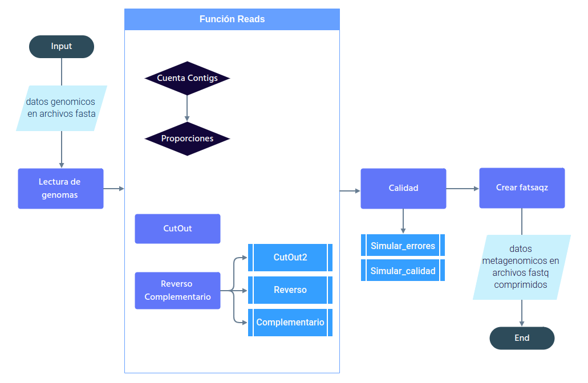

# PyMetaSeem: generador de lecturas metagenómicas

PyMetaSeem es un simulador de datos metagenómicos escrito desde cero en Python. A partir de uno o
varios genomas de referencia en formato FASTA genera lecturas recortadas al azar y las escribe en
archivos FASTQ comprimidos, con calidades asociadas. Como la composición del metagenoma simulado se
conoce de antemano, sirve para evaluar la exactitud de clasificadores taxonómicos y ensambladores,
y para probar métricas como el N50 (`N50/`).

Se concibió como una alternativa sencilla de instalar y usar frente a simuladores como
[CAMISIM](https://github.com/CAMI-challenge/CAMISIM), cuya instalación y configuración resultan
difíciles, y como una forma de entender su funcionamiento interno. En la tesis aparece como línea
de trabajo futuro (capítulo 6): generar metagenomas sintéticos para fortalecer el análisis
estadístico de la fresa.

## Funcionamiento

1. **Entrada.** Un conjunto de archivos FASTA y, de forma manual o mediante un archivo de texto con
   el perfil taxonómico, el número y la longitud de las lecturas por genoma. Los encabezados FASTA
   deben estar simplificados; el cuaderno principal muestra cómo hacerlo con `sed`.
2. **Lectura de genomas.** Cada FASTA se convierte en un diccionario de Python con el identificador
   de cada contig como llave y su secuencia como valor.
3. **Proporciones.** Se calculan las longitudes de los contigs y la proporción de lecturas que debe
   salir de cada uno, según su tamaño relativo dentro del genoma.
4. **Corte.** Se recortan `m` lecturas aleatorias de longitud `n` de cada secuencia.
5. **Reverso complementario.** A cada lectura se le calcula el reverso complementario, para simular
   lecturas de ambas hebras.
6. **Salida.** Una función reúne los pasos anteriores en un diccionario de lecturas y otra lo
   escribe como FASTQ comprimido con sus calidades.

## Archivos

| Archivo | Contenido |
|---|---|
| `PyMetaSeem_Cami.ipynb` | Cuaderno principal. Explica cada función con ejemplos y contiene la versión completa del simulador. |
| `PyMetaSeem_Cf.ipynb` | Versión compacta que lee el perfil taxonómico `Data/ReadsFonty/cut_head/table.txt` y genera las lecturas de los diez genomas de la comunidad simulada. |
| `PyMetaSeem_Clase.ipynb` | Reorganización del simulador como una clase de Python, para procesar varios genomas a la vez. En desarrollo. |
| `Img/` | Diagrama de flujo, ilustraciones de la métrica N50 y capturas de pantalla de ejemplos. |

## Datos de prueba

- `Data/ReadsFonty/`: comunidad simulada de ocho bacterias y dos levaduras, con su perfil taxonómico.
- `Data/Clavibacter/`: genomas de *Clavibacter*, con encabezados ya recortados.

## Pendientes

- Terminar la versión en clase y convertirla en un paquete instalable con un ambiente conda.
- Modelar las calidades de las lecturas y las tasas de error de la plataforma de secuenciación,
  que hoy son fijas.
- Conectar el simulador con los perfiles taxonómicos estimados de la fresa para generar datos
  sintéticos por grupo (saludable y no saludable).
